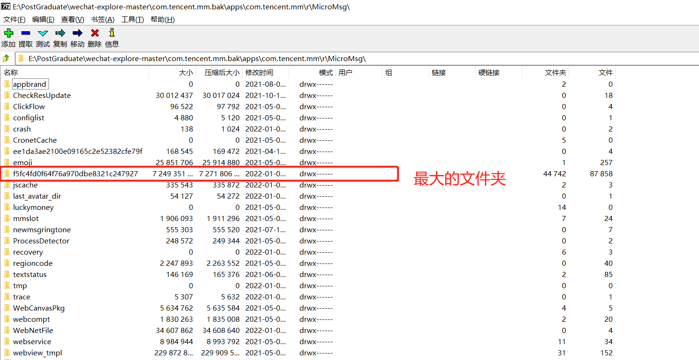
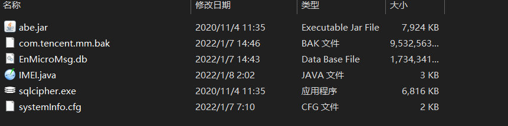
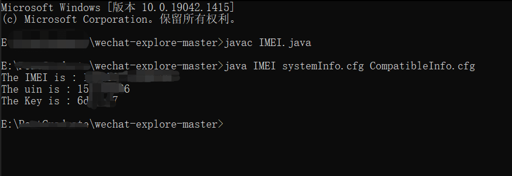
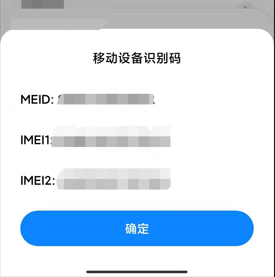
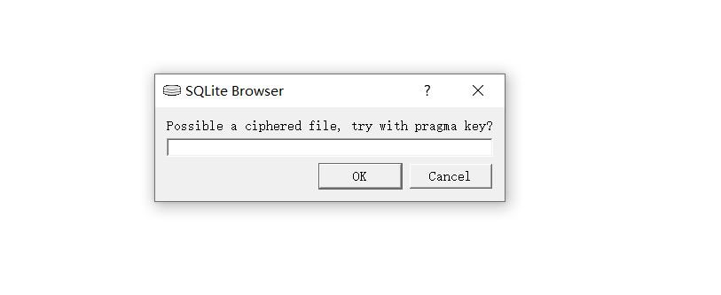
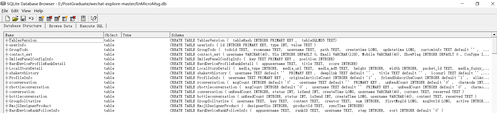
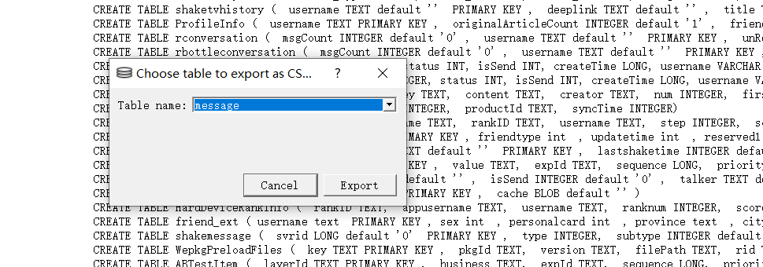
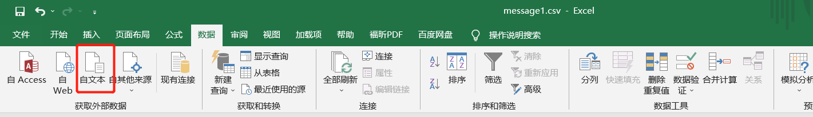
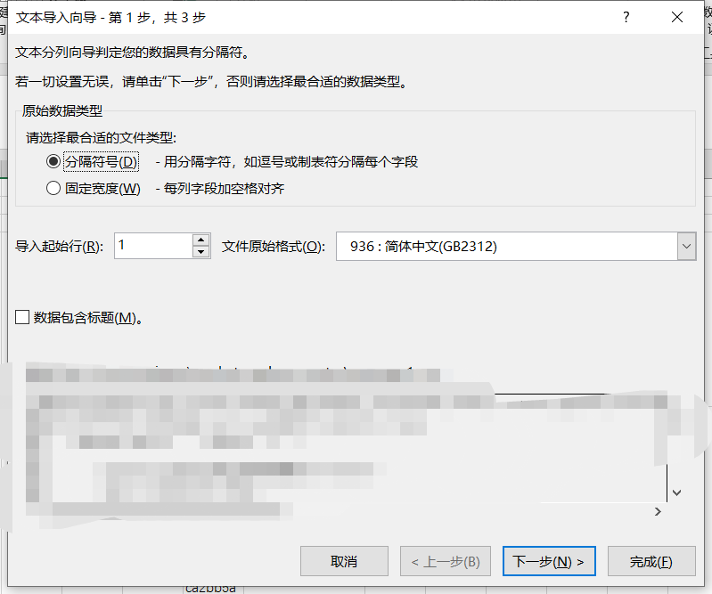
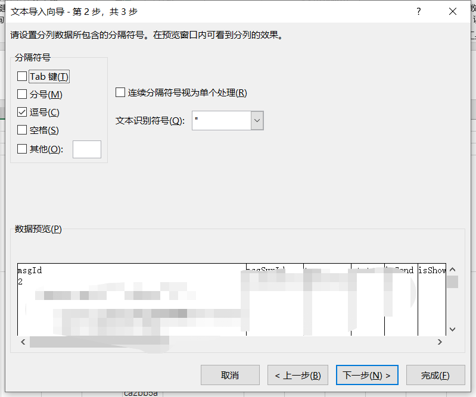

## 0 说明和参考

### 说明

有一定的编程基础最好，当然没有也行，按照步骤来即可。

### 参考

本文参考以下几个链接，如有侵权，联系删除

[Android手机代码的输入](https://zhidao.baidu.com/question/535026026.html)

[微信聊天记录导出为电脑txt文件教程](https://zhuanlan.zhihu.com/p/77418711)

[微信聊天记录导出(2020新版)](https://github.com/fly-dragon211/Wechat-message-analysis)

## 1 工具

### 1.1 配置Java环境

因为后面解析微信聊天的数据库的时候，暴力破解的脚本是Java写的，所以这里建议先配置Java环境。


**Window10**`Java`配置链接如下：[Java/JDK下载安装与环境配置（Windows 10 超详细的图文版教程 ）](https://blog.csdn.net/qq_26552691/article/details/94598788)

Windows7和Windows10基本相同，只是Windows10在配置Path环境变量时，需要换行，如下所示


**MAC**下，自行百度


### 1.2 Python环境

这个也百度安装即可

## 2 导出手机数据库到电脑

> 主要是将手机中的聊天数据库文件传输到电脑上，找对文件的路径即可，并不复杂。

主要参考[链接](https://zhuanlan.zhihu.com/p/77418711)，这里主要以**红米K40**为例子，Android手机类似。苹果手机的话，暂时未尝试。

### 2.1 手机备份

首先进入手机的`设置-更多设置-备份和重置-手机备份恢复`，输入密码，点击新建备份。只用选择第三方应用程序和应用数据，选择列表中的微信，点击开始备份，等待完成就行了。

### 2.2 手机路径

找到手机目录下的MIUI/backup/AllBackup/yyyymmdd_xxxxxx/微信(com.tencent.mm).bak，将.bak文件拷贝到电脑上。说明：`yyyymmdd_xxxxxx`表示备份的日期。

### 2.3 传输到电脑

将文件传输到电脑上，从步骤二中可以看到文件大小将近10G。这里我推荐大家使用`数据线`进行传输。当然小米手机支持在同一个局域网下无线传输。一个数据线连接电脑的教程链接在这里：[手机连接电脑](https://www.gpbctv.com/edu/202108/343274.html)。总结了一下，大概分成以下几个步骤。

> 1. 打开手机的[开发者模式](http://www.xda.cn/zixun/2020812/0801561.html)
> 2. 在开发者模式中找到USB调试
> 3. 用数据线将手机连接到电脑，这里可能是数据线的问题，手机会连接不上电脑。一般情况下，连接上之后，手机会出现选择数据传输、仅充电等模式。
> 4. 在电脑上找到步骤二中提到的文件路径，复制到一个文件夹路径下。

  当然，也可以使用无线传输：[链接](https://www.zhihu.com/zvideo/1417507412484546560)

### 2.4 解压`bak`文件

得到`.bak`文件之后，需要对该文件进行解析，因为我们需要的文件就只有三个。这里推荐使用[7-zip](https://sparanoid.com/lab/7z/)打开`com.tencent.mm.bak`文件(这个文件原本是微信(com.tencent.mm).bak，被我重新命名了而已)。
将`apps\com.tencent.mm\r\MicroMsg\systemInfo.cfg`、`apps\com.tencent.mm\r\MicroMsg\CompatibleInfo.cfg`和`apps\com.tencent.mm\r\MicroMsg\xxxx\EnMicroMsg.db`三个文件解压到电脑上。这里xxxx是一串随机的字母，代表你的微信用户，每个人不一样，一般是**最大的那个文件夹**，如下图所示：




####  一些QA：

如果第四步中，不用`7-Zip`，用的是`Bandzip`的话会出现文件已经损坏的错误。总而言之，这里大家使用`7Zip`即可。


## 3 解析数据库密码

> 其实`EnMicroMsg.db`就是我们需要的聊天数据库文件，但是`EnMicroMsg.db`是个加密的`SQLite`数据库。所以，我们需要破解该数据库的密码。密码使用MD5编码（IMEI+uin），取前7位（小写）作为密码。这里不懂没关系，看后面的解释。
这一步是关键步骤，破解还是比较麻烦的，但是并不难的！


### 3.1 准备文件
1. 将[GitHub仓库](https://github.com/wangc39/wechat-database-explore)中的文件下载到电脑上，将文件和上述步骤中得到的三个文件放到一个文件路径下，如下图所示。



### 3.2 Java运行程序

在 3.1 的文件路径下，命令行执行以下代码。可以用Windows的`CMD`，也可以用`Git Bash`
```java
javac IMEI.java
java IMEI systemInfo.cfg CompatibleInfo.cfg

```

在非常正常的情况下，程序将得到正确密码，如下图所示


好了，下面说说失败了怎么办？成功请直接看**提取数据库**的部分


### 3.3 破解失败的一些尝试

`CompatibleInfo.cfg`其实是存放 `IMEI` 的地方，如果仔细查看该文件的大小，发现该文件为0字节，这说明我们的 `IMEI` 是空的。采用的是默认的  `1234567890ABCDEF` 。
一般情况下，我们的这个文件应该不是空的，在上一步中就能得到正确的`IMEI`。如果文件为空的话，我这里对原始的 `java` 代码进行了修改，就会使用默认的 `1234567890ABCDEF` 来代替 `IMEI`，输出最后的密码 `key` 。如果代码失败了，那可以尝试下面的一种方法。

在`Android`拨号键盘中输入 `*#06#`，将会出现`IMEI`




将 `IMEI + uin` 组合，如 `IMEI` 为 `123456` ，`uin` 为 `abc` ，则拼接后的字符串为 `123456abc` 将此字符串用 `MD5` 加密(32位)后 `df10ef8509dc176d733d59549e7dbfaf` 那么前7位 `df10ef8` 就是数据库的密码，注意密码是小写的密码。[MD5在线加密](http://tool.chinaz.com/tools/md5.aspx)

## 4 提取数据库文件

### 4.1 输入密码

然后打开 `sqlcipher.exe` 软件，用它打开 `EnMicroMsg.db `数据库，输入得到的密码



成功之后，就可以看到很多表组成的数据库文件



### 4.2 提取文件


点击菜单栏的File-Export-Table as CSV file，选择message表，并导出 `message.csv` 文件





### 4.3 导入到Excel中

如果直接打开会很乱，因为这个文件使用 `,` 进行分割，所以这里我们先打开 excel 文件








----
## [补充] 破解数据库密码的几种方式

> 参考
> [微信聊天记录导出(2020新版)](https://github.com/fly-dragon211/Wechat-message-analysis)
> [手工解密微信聊天数据库的四个大坑](https://www.sohu.com/a/355273307_704736)


----
以下文字来源于第一个`GitHub`教程

数据库密码有很多种生成方式：

1. 手机IMEI+uin(微信用户id userinformation) 将拼接的字符串MD5加密取前7位

> 如 `IMEI` 为 `123456` `，uin` 为 `abc` ，则拼接后的字符串为 `123456abc` 将此字符串用 `MD5` 加密(32位)后 `df10ef8509dc176d733d59549e7dbfaf` 那么前7位 `df10ef8` 就是数据库的密码，由于有的手机是双卡，有多个IMEI，或者当手机获取不到IMEI时会用默认字符串 `1234567890ABCDEF` 来代替，由于种种原因，并不是所有人都能得出正确的密码，此时我们可以换一种方法。

2. 反序列化 `CompatibleInfo.cfg` 和 `systemInfo.cfg`

不管是否有多个 `IMEI` ，或者是微信客户端没有获取到 `IMEI` ，而使用默认字符串代替，微信客户端都会将使用的信息保存在 `MicroMsg` 文件夹下面的 `CompatibleInfo.cfg`和 `systemInfo.cfg `文件中，可以通过这两个文件来得到正确的密码，但是这两个文件需要处理才能看到信息。

3. 使用hook方式得到数据库的密码，这个方法最有效[参考](https://blog.csdn.net/qq_24280381/article/details/73521836)

4. 暴力破解


这里的**反序列化**其实就是我们上面是用的教程