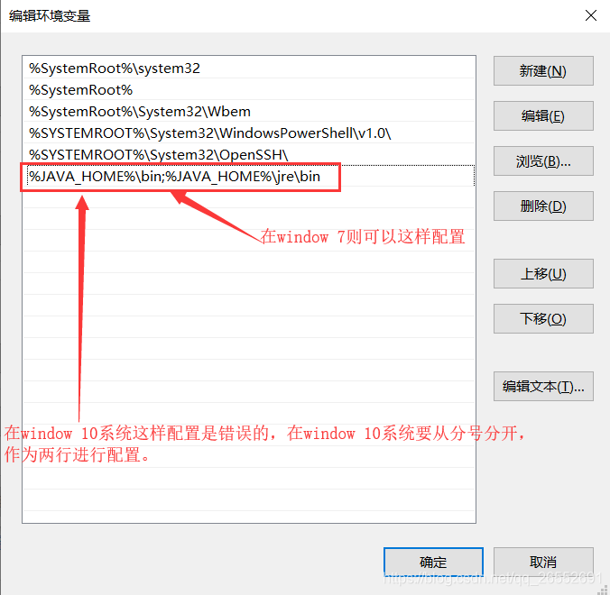
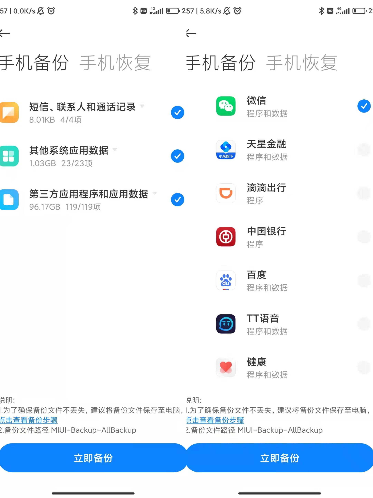
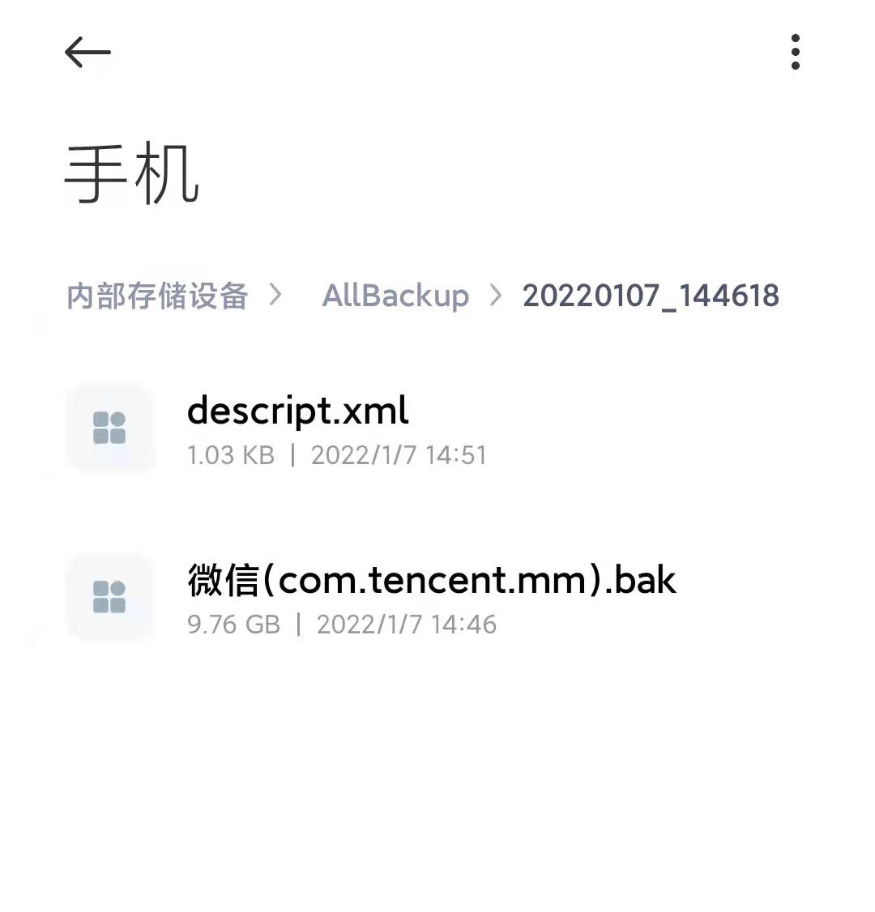

## 0 说明和参考

### 说明

有一定的编程基础最好，当然没有也行，按照步骤来即可。

### 参考

本文参考以下几个链接，如有侵权，联系删除

[Android手机代码的输入](https://zhidao.baidu.com/question/535026026.html)

[微信聊天记录导出为电脑txt文件教程](https://zhuanlan.zhihu.com/p/77418711)

## 1 工具

### 1.1 配置Java环境

因为后面解析微信聊天的数据库的时候，暴力破解的脚本是Java写的，所以这里建议先配置Java环境。

**Window10**`Java`配置链接如下：[Java/JDK下载安装与环境配置（Windows 10 超详细的图文版教程 ）](https://blog.csdn.net/qq_26552691/article/details/94598788)

Windows7和Windows10基本相同，只是Windows10在配置Path环境变量时，需要换行，如下所示

**MAC**下，自行百度

### 1.2 Python环境

这个也百度安装即可

## 2 导出手机数据库到电脑

主要参考[链接](https://zhuanlan.zhihu.com/p/77418711)，这里主要以**红米K40**为例子，Android手机类似。苹果手机的话，暂时未尝试。

1. 首先进入手机的`设置-更多设置-备份和重置-手机备份恢复`，输入密码，点击新建备份。只用选择第三方应用程序和应用数据，选择列表中的微信，点击开始备份，等待完成就行了。

2. 找到手机目录下的MIUI/backup/AllBackup/yyyymmdd_xxxxxx/微信(com.tencent.mm).bak，将.bak文件拷贝到电脑上。说明：`yyyymmdd_xxxxxx`表示备份的日期。

3. 将文件传输到电脑上，从步骤二中可以看到文件大小将近10G。这里我推荐大家使用`数据线`进行传输。当然小米手机支持在同一个局域网下无线传输。一个数据线连接电脑的教程链接在这里：[手机连接电脑](https://www.gpbctv.com/edu/202108/343274.html)。总结了一下，大概分成以下几个步骤。

> 1. 打开手机的[开发者模式](http://www.xda.cn/zixun/2020812/0801561.html)
> 2. 在开发者模式中找到USB调试
> 3. 用数据线将手机连接到电脑，这里可能是数据线的问题，手机会连接不上电脑。一般情况下，连接上之后，手机会出现选择数据传输、仅充电等模式。
> 4. 在电脑上找到步骤二中提到的文件路径，复制到一个文件夹路径下。

当然，也可以使用无线传输：[链接](https://www.zhihu.com/zvideo/1417507412484546560)

## 3 解析数据库

